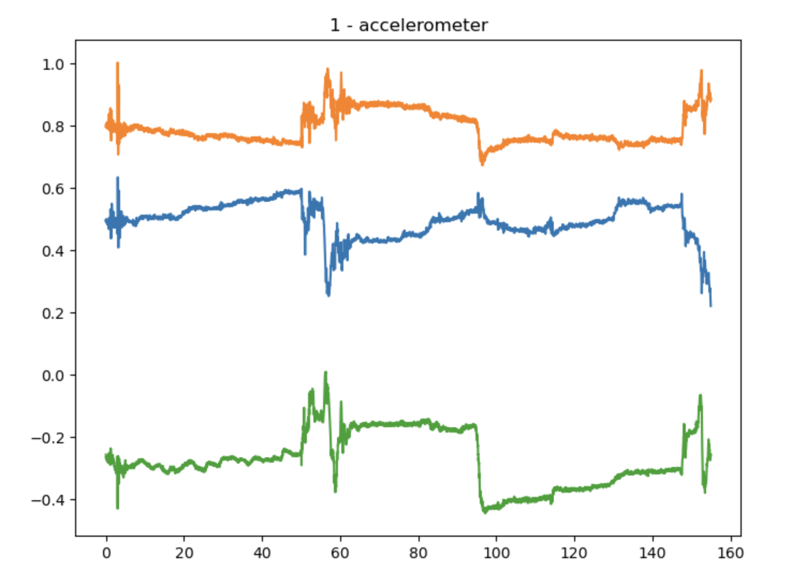
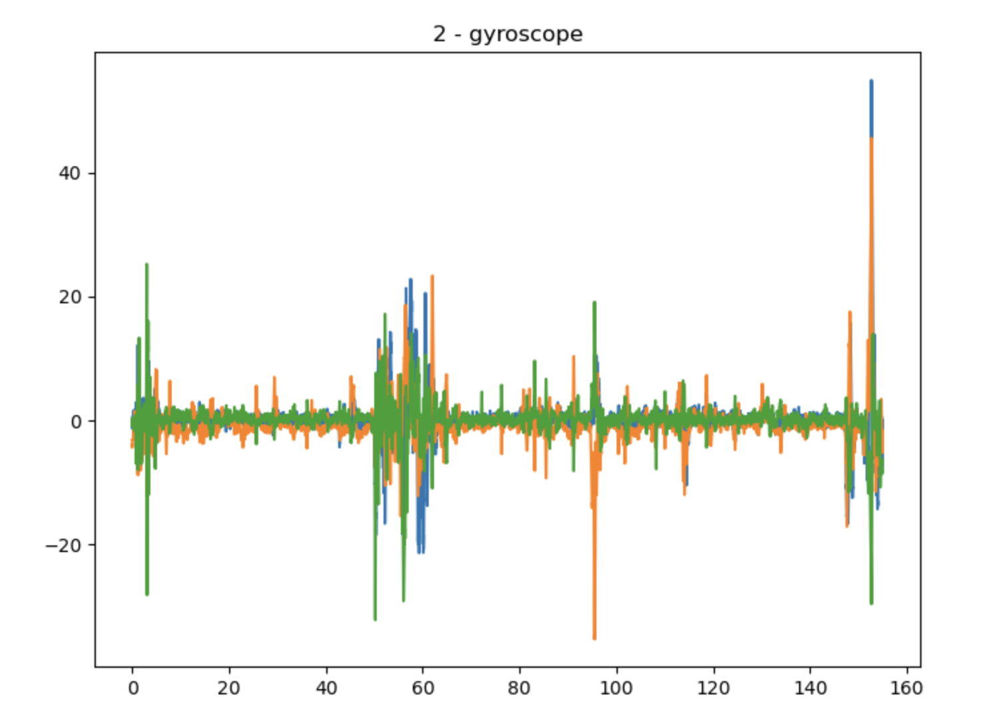
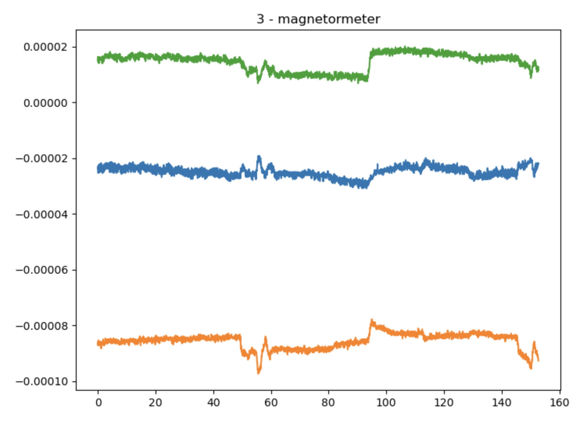

# Activity Detection Machine Learning Project

## Project Overview

This project focuses on detecting human activities using machine learning techniques. The dataset includes sensor data from 15 users performing various activities. The data is segmented and features are extracted using a sliding window approach. Multiple machine learning models, including logistic regression, decision trees, random forest, and neural networks, are trained and evaluated. The results indicate that Random Forest, XGBoost, and CNN models perform the best in recognizing activities.

## Human Activity Recognition Dataset

This dataset contains activity tracking data collected from **15 users** performing **15 different activities** each. The activities include actions such as sitting, standing, walking, running, using a computer, and performing object manipulation tasks like picking up items from the floor. Each activity is labeled and categorized, with transition states included for specific scenarios (e.g., stationary to wearing a device). There are some missing data. The frequency of the sensors is 100Hz.

### Dataset Details

The dataset includes data from 15 individuals (User IDs 13-27) performing various activities. These activities are categorized into sitting (reading, writing, typing, browsing, moving head/body, moving chair), standing (static standing, picking up items from the floor), dynamic (walking, running, taking stairs), and transitions (stationary to wearing a device, putting it back, and stationary with a 15-second delay). Each activity is documented with corresponding experiment numbers and labeled files. Some entries contain missing sensor data, such as accelerometer and gyroscope data.

### Sensor Data Figures

To better understand the dataset, we provide visualizations of the sensor data collected from the accelerometer, gyroscope, and magnetometer. These figures are located in the `figures` folder.

    

        
        
<strong>Accelerometer Data</strong>

        
Shows raw acceleration forces in X, Y, and Z  
        axes during activities.

    

    

        
        
<strong>Gyroscope Data</strong>

        
Illustrates rotation rates around X, Y, and Z  
        axes.

    

    

        
        
<strong>Magnetometer Data</strong>

        
Presents magnetic field strength along X, Y, and Z  
        axes.

    

## Feature Extraction Overview

This feature extraction process segments accelerometer and gyroscope data using a sliding window approach to compute statistical features for activity recognition. The data is segmented with configurable **window sizes** (e.g., **100**, **200**, **300**, etc.) and **overlap percentages** (e.g., **25%**, **50%**). The step size is calculated as `window_size * (1 - overlap)`. For each segment, the mean, median, variance, and standard deviation are computed for each axis (`x`, `y`, `z`) of the accelerometer and gyroscope data. The process involves segmenting the sensor data for each experiment ID, calculating the features for each window, and appending the user IDs. Missing data is handled appropriately, and the results are aggregated into a DataFrame. The feature files are saved as `features/w{window_size}_o{overlap_percentage}_features.csv` for multiple configurations.

### Machine Learning Models and Techniques

The uploaded Jupyter Notebook indicates that various machine learning models were utilized. Here’s a list of models and techniques identified from the notebook:

### Models Used:

1. **Logistic Regression** - A linear classifier for baseline comparisons.
2. **Naive Bayes (GaussianNB)** - Fast probabilistic model assuming feature independence.
3. **Support Vector Machines (SVC)** - Effective for non-linear and high-dimensional data.
4. **Decision Tree Classifier** - Interpretable tree-based model for classification.
5. **K-Nearest Neighbors (KNN)** - Distance-based classifier for simple patterns.
6. **Random Forest Classifier** - Ensemble method reducing overfitting.
7. **AdaBoost Classifier** - Boosting weak learners for improved performance.
8. **Gradient Boosting Classifier** - Sequentially reduces residual errors.
9. **XGBoost Classifier** - High-performance gradient boosting implementation.
10. **Neural Networks (Keras)**:
    - **Dense Layers** - Fully connected layers for classification tasks.
    - **CNN (Conv1D)** - Captures spatial patterns in sequential data.
    - **LSTM** - Captures temporal dependencies in sequential data.
    - **SimpleRNN** - Handles simpler sequential patterns.

### Supporting Techniques:

- **Standard Scaler** - Normalizes data for consistent scale.
- **Principal Component Analysis (PCA)** - Reduces dimensionality for efficiency.
- **Cross-Validation (KFold, StratifiedKFold)** - Ensures robust model evaluation.
- **GridSearchCV and RandomizedSearchCV** - Optimizes hyperparameters.
- **TSFresh** - Automates feature extraction from time-series data.

## Results

The results demonstrate that ensemble models such as Random Forest, XGBoost, and Gradient Boost consistently achieved the best performance, with accuracies reaching up to 68% and F1-scores of 0.68 in configurations with larger window sizes (e.g., 500) and higher overlaps (e.g., 50%). Among neural networks, Artificial Neural Networks (ANN) performed competitively, achieving up to 60% accuracy, but were generally outperformed by ensemble models. Larger window sizes and overlaps improved feature representation, enhancing model accuracy and robustness. Ensemble methods emerged as the most reliable classifiers for activity recognition, effectively capturing complex patterns in the data.

---

### Window 100 & 25% Overlap

| Model                            | Accuracy | Precision | Recall | F1 Score | K-Fold Score | Stratified Score |
| -------------------------------- | -------- | --------- | ------ | -------- | ------------ | ---------------- |
| Logistic Regression              | 0.30     | 0.30      | 0.30   | 0.28     | 0.25         | 0.26             |
| Decision Trees                   | 0.51     | 0.51      | 0.51   | 0.51     | 0.601        | 0.603            |
| Random Forest                    | 0.64     | 0.64      | 0.64   | 0.64     | 0.72         | 0.72             |
| Gaussian Naïve Bayes             | 0.22     | 0.23      | 0.22   | 0.19     | 0.13         | 0.13             |
| Support Vector Classifier        | 0.56     | 0.55      | 0.56   | 0.55     | 0.275        | 0.274            |
| KNN                              | 0.52     | 0.54      | 0.52   | 0.51     | 0.36         | 0.365            |
| AdaBoost                         | 0.32     | 0.32      | 0.32   | 0.26     | 0.324        | 0.323            |
| XGBoost                          | 0.64     | 0.64      | 0.64   | 0.64     | 0.719        | 0.715            |
| Gradient Boost                   | 0.60     | 0.61      | 0.60   | 0.60     | 0.65         | 0.648            |
| Artificial Neural Networks (ANN) | 0.57     | 0.57      | 0.57   | 0.57     | 0.464        | 0.487            |

---

### Window 100 & 50% Overlap

| Model                            | Accuracy | Precision | Recall | F1 Score | K-Fold Score | Stratified Score |
| -------------------------------- | -------- | --------- | ------ | -------- | ------------ | ---------------- |
| Logistic Regression              | 0.29     | 0.29      | 0.29   | 0.26     | 0.25         | 0.24             |
| Decision Trees                   | 0.53     | 0.54      | 0.53   | 0.54     | 0.62         | 0.63             |
| Random Forest                    | 0.68     | 0.69      | 0.68   | 0.68     | 0.76         | 0.77             |
| Gaussian Naïve Bayes             | 0.26     | 0.26      | 0.26   | 0.22     | 0.13         | 0.13             |
| Support Vector Classifier        | 0.58     | 0.58      | 0.58   | 0.57     | 0.29         | 0.29             |
| KNN                              | 0.55     | 0.56      | 0.55   | 0.53     | 0.37         | 0.37             |
| AdaBoost                         | 0.35     | 0.41      | 0.35   | 0.30     | 0.34         | 0.33             |
| XGBoost                          | 0.67     | 0.63      | 0.63   | 0.62     | 0.66         | 0.66             |
| Gradient Boost                   | 0.63     | 0.68      | 0.67   | 0.67     | 0.73         | 0.73             |
| Artificial Neural Networks (ANN) | 0.60     | 0.59      | 0.60   | 0.59     | 0.52         | 0.53             |

---

### Window 200 & 25% Overlap

| Model                            | Accuracy | Precision | Recall | F1 Score | K-Fold Score | Stratified Score |
| -------------------------------- | -------- | --------- | ------ | -------- | ------------ | ---------------- |
| Logistic Regression              | 0.31     | 0.31      | 0.31   | 0.29     | 0.174        | 0.174            |
| Decision Trees                   | 0.63     | 0.63      | 0.63   | 0.62     | 0.72         | 0.72             |
| Random Forest                    | 0.47     | 0.48      | 0.47   | 0.47     | 0.591        | 0.593            |
| Gaussian Naïve Bayes             | 0.25     | 0.26      | 0.25   | 0.22     | 0.26         | 0.259            |
| Support Vector Classifier        | 0.55     | 0.55      | 0.55   | 0.55     | 0.25         | 0.255            |
| KNN                              | 0.49     | 0.53      | 0.49   | 0.48     | 0.349        | 0.349            |
| AdaBoost                         | 0.34     | 0.4       | 0.34   | 0.29     | 0.325        | 0.328            |
| XGBoost                          | 0.64     | 0.63      | 0.64   | 0.63     | 0.72         | 0.72             |
| Gradient Boost                   | 0.61     | 0.60      | 0.61   | 0.60     | 0.662        | 0.663            |
| Artificial Neural Networks (ANN) | 0.55     | 0.55      | 0.55   | 0.55     | 0.396        | 0.406            |

---

### Window 200 & 50% Overlap

| Model                            | Accuracy | Precision | Recall | F1 Score | K-Fold Score | Stratified Score |
| -------------------------------- | -------- | --------- | ------ | -------- | ------------ | ---------------- |
| Logistic Regression              | 0.32     | 0.33      | 0.32   | 0.30     | 0.179        | 0.180            |
| Decision Trees                   | 0.54     | 0.53      | 0.54   | 0.53     | 0.631        | 0.633            |
| Random Forest                    | 0.68     | 0.68      | 0.68   | 0.67     | 0.766        | 0.768            |
| Gaussian Naïve Bayes             | 0.24     | 0.27      | 0.24   | 0.21     | 0.153        | 0.152            |
| Support Vector Classifier        | 0.59     | 0.59      | 0.59   | 0.58     | 0.277        | 0.277            |
| KNN                              | 0.53     | 0.55      | 0.53   | 0.51     | 0.369        | 0.371            |
| AdaBoost                         | 0.37     | 0.40      | 0.37   | 0.32     | 0.351        | 0.353            |
| XGBoost                          | 0.67     | 0.67      | 0.67   | 0.66     | 0.747        | 0.747            |
| Gradient Boost                   | 0.63     | 0.63      | 0.63   | 0.62     | 0.685        | 0.681            |
| Artificial Neural Networks (ANN) | 0.60     | 0.59      | 0.60   | 0.60     | 0.445        | 0.440            |

---

### Window 300 & 25% Overlap

| Model                            | Accuracy | Precision | Recall | F1 Score | K-Fold Score | Stratified Score |
| -------------------------------- | -------- | --------- | ------ | -------- | ------------ | ---------------- |
| Logistic Regression              | 0.32     | 0.32      | 0.32   | 0.30     | 0.139        | 0.137            |
| Decision Trees                   | 0.47     | 0.46      | 0.47   | 0.46     | 0.585        | 0.580            |
| Random Forest                    | 0.62     | 0.62      | 0.62   | 0.61     | 0.724        | 0.726            |
| Gaussian Naïve Bayes             | 0.30     | 0.31      | 0.30   | 0.27     | 0.149        | 0.151            |
| Support Vector Classifier        | 0.54     | 0.54      | 0.54   | 0.53     | 0.236        | 0.236            |
| KNN                              | 0.48     | 0.52      | 0.48   | 0.46     | 0.345        | 0.344            |
| AdaBoost                         | 0.39     | 0.40      | 0.39   | 0.36     | 0.325        | 0.328            |
| XGBoost                          | 0.63     | 0.63      | 0.63   | 0.62     | 0.726        | 0.724            |
| Gradient Boost                   | 0.58     | 0.58      | 0.58   | 0.57     | 0.670        | 0.671            |
| Artificial Neural Networks (ANN) | 0.56     | 0.55      | 0.56   | 0.55     | 0.370        | 0.376            |

---

### Window 300 & 50% Overlap

| Model                            | Accuracy | Precision | Recall | F1 Score | K-Fold Score | Stratified Score |
| -------------------------------- | -------- | --------- | ------ | -------- | ------------ | ---------------- |
| Logistic Regression              | 0.33     | 0.34      | 0.33   | 0.31     | 0.318        | 0.316            |
| Decision Trees                   | 0.50     | 0.50      | 0.50   | 0.50     | 0.635        | 0.637            |
| Random Forest                    | 0.66     | 0.66      | 0.66   | 0.66     | 0.771        | 0.770            |
| Gaussian Naïve Bayes             | 0.28     | 0.31      | 0.28   | 0.25     | 0.275        | 0.275            |
| Support Vector Classifier        | 0.58     | 0.57      | 0.58   | 0.57     | 0.256        | 0.255            |
| KNN                              | 0.51     | 0.54      | 0.51   | 0.49     | 0.372        | 0.372            |
| AdaBoost                         | 0.35     | 0.40      | 0.35   | 0.34     | 0.344        | 0.334            |
| XGBoost                          | 0.66     | 0.66      | 0.66   | 0.66     | 0.758        | 0.761            |
| Gradient Boost                   | 0.62     | 0.61      | 0.62   | 0.61     | 0.697        | 0.693            |
| Artificial Neural Networks (ANN) | 0.60     | 0.59      | 0.60   | 0.59     | 0.422        | 0.423            |

---

### Window 400 & 25% Overlap

| Model                            | Accuracy | Precision | Recall | F1 Score | K-Fold Score | Stratified Score |
| -------------------------------- | -------- | --------- | ------ | -------- | ------------ | ---------------- |
| Logistic Regression              | 0.35     | 0.36      | 0.35   | 0.33     | 0.334        | 0.332            |
| Decision Trees                   | 0.46     | 0.46      | 0.46   | 0.46     | 0.582        | 0.580            |
| Random Forest                    | 0.61     | 0.61      | 0.61   | 0.60     | 0.725        | 0.723            |
| Gaussian Naïve Bayes             | 0.30     | 0.33      | 0.30   | 0.28     | 0.289        | 0.289            |
| Support Vector Classifier        | 0.54     | 0.54      | 0.54   | 0.53     | 0.222        | 0.223            |
| KNN                              | 0.47     | 0.51      | 0.47   | 0.45     | 0.349        | 0.351            |
| AdaBoost                         | 0.38     | 0.42      | 0.38   | 0.38     | 0.344        | 0.361            |
| XGBoost                          | 0.62     | 0.61      | 0.62   | 0.61     | 0.738        | 0.735            |
| Gradient Boost                   | 0.58     | 0.58      | 0.58   | 0.58     | 0.676        | 0.672            |
| Artificial Neural Networks (ANN) | 0.56     | 0.56      | 0.56   | 0.56     | 0.350        | 0.345            |

---

### Window 400 & 50% Overlap

| Model                            | Accuracy | Precision | Recall | F1 Score | K-Fold Score | Stratified Score |
| -------------------------------- | -------- | --------- | ------ | -------- | ------------ | ---------------- |
| Logistic Regression              | 0.35     | 0.36      | 0.35   | 0.33     | 0.338        | 0.335            |
| Decision Trees                   | 0.51     | 0.51      | 0.51   | 0.51     | 0.628        | 0.630            |
| Random Forest                    | 0.66     | 0.65      | 0.66   | 0.65     | 0.776        | 0.775            |
| Gaussian Naïve Bayes             | 0.31     | 0.34      | 0.31   | 0.28     | 0.291        | 0.290            |
| Support Vector Classifier        | 0.59     | 0.59      | 0.59   | 0.59     | 0.253        | 0.252            |
| KNN                              | 0.49     | 0.53      | 0.49   | 0.48     | 0.376        | 0.379            |
| AdaBoost                         | 0.38     | 0.39      | 0.38   | 0.37     | 0.348        | 0.343            |
| XGBoost                          | 0.67     | 0.66      | 0.67   | 0.66     | 0.771        | 0.767            |
| Gradient Boost                   | 0.63     | 0.62      | 0.63   | 0.62     | 0.709        | 0.709            |
| Artificial Neural Networks (ANN) | 0.59     | 0.59      | 0.59   | 0.59     | 0.412        | 0.393            |

---

### Window 500 & 25% Overlap

| Model                            | Accuracy | Precision | Recall | F1 Score | K-Fold Score | Stratified Score |
| -------------------------------- | -------- | --------- | ------ | -------- | ------------ | ---------------- |
| Logistic Regression              | 0.36     | 0.37      | 0.36   | 0.35     | 0.202        | 0.207            |
| Decision Trees                   | 0.46     | 0.46      | 0.46   | 0.45     | 0.590        | 0.589            |
| Random Forest                    | 0.60     | 0.60      | 0.60   | 0.60     | 0.732        | 0.733            |
| Gaussian Naïve Bayes             | 0.29     | 0.32      | 0.29   | 0.27     | 0.172        | 0.173            |
| Support Vector Classifier        | 0.55     | 0.55      | 0.55   | 0.54     | 0.218        | 0.214            |
| KNN                              | 0.45     | 0.50      | 0.45   | 0.43     | 0.353        | 0.356            |
| AdaBoost                         | 0.35     | 0.37      | 0.35   | 0.30     | 0.320        | 0.317            |
| XGBoost                          | 0.61     | 0.60      | 0.61   | 0.60     | 0.740        | 0.745            |
| Gradient Boost                   | 0.57     | 0.57      | 0.57   | 0.57     | 0.687        | 0.688            |
| Artificial Neural Networks (ANN) | 0.57     | 0.57      | 0.57   | 0.57     | 0.341        | 0.348            |

---

### Window 500 & 50% Overlap

| Model                            | Accuracy | Precision | Recall | F1 Score | K-Fold Score | Stratified Score |
| -------------------------------- | -------- | --------- | ------ | -------- | ------------ | ---------------- |
| Logistic Regression              | 0.37     | 0.37      | 0.37   | 0.36     | 0.203        | 0.206            |
| Decision Trees                   | 0.51     | 0.51      | 0.51   | 0.51     | 0.630        | 0.630            |
| Random Forest                    | 0.66     | 0.66      | 0.66   | 0.66     | 0.780        | 0.780            |
| Gaussian Naïve Bayes             | 0.31     | 0.34      | 0.31   | 0.29     | 0.310        | 0.308            |
| Support Vector Classifier        | 0.58     | 0.58      | 0.58   | 0.57     | 0.241        | 0.240            |
| KNN                              | 0.49     | 0.53      | 0.49   | 0.48     | 0.373        | 0.378            |
| AdaBoost                         | 0.37     | 0.40      | 0.37   | 0.36     | 0.376        | 0.376            |
| XGBoost                          | 0.67     | 0.67      | 0.67   | 0.67     | 0.779        | 0.780            |
| Gradient Boost                   | 0.62     | 0.62      | 0.62   | 0.62     | 0.718        | 0.716            |
| Artificial Neural Networks (ANN) | 0.56     | 0.56      | 0.56   | 0.56     | 0.368        | 0.343            |

### Deep Learning Results

For **Window Size: 500, Overlap: 25%**, the following results were achieved:

- **LSTM**: 53.25% accuracy
- **CNN**: 65.78% accuracy
- **RNN**: 49.43% accuracy

### Feature Extraction Using TSFresh

- TSFresh extracted **2,351 features** for each window configuration.
- The number of rows generated:
  - Window 400, Overlap 25%: 19,146 rows
  - Window 400, Overlap 50%: 28,654 rows
  - Window 500, Overlap 25%: 15,287 rows
  - Window 500, Overlap 50%: 22,789 rows
- PCA retained 95% variance with **5 features**.

### Conclusion

Random Forest, XGBoost, and CNN emerged as the most effective models, with CNN achieving the highest accuracy for sequential data.
